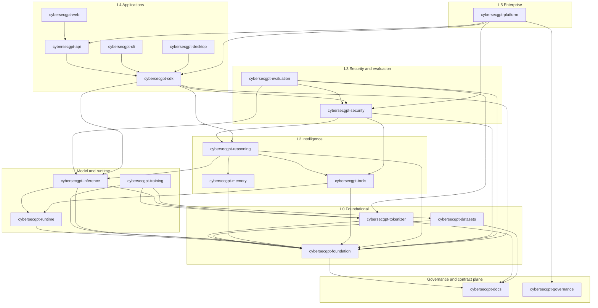
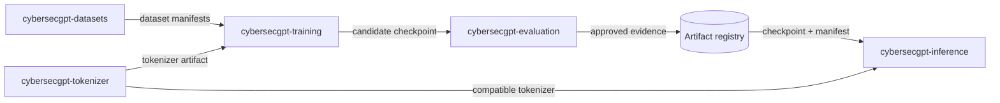
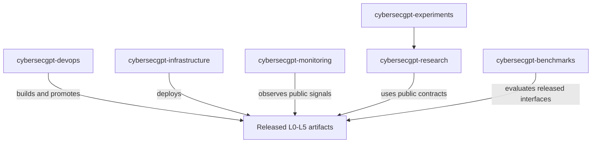
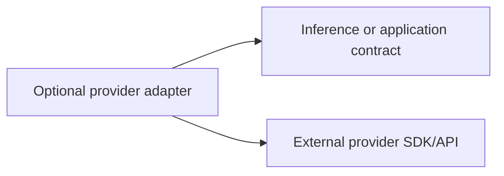

# Dependency Graph

## Status and direction

- **Established:** the production dependency graph is acyclic.
- **Established:** external AI providers are optional adapters at the boundary.
- **Established:** ADR-0003 and ADR-0004 accept the layers and repository
  assignments below.
- **Observed:** most repositories are empty, so this graph constrains future
  implementation rather than describing current imports.

In this document, `A --> B` means **A may depend on B's public contract**. It does
not permit access to B's private modules or storage.

## Layer rules

| Layer | Role | May depend on |
| --- | --- | --- |
| L0 Foundational | shared contracts, tokenizer, dataset interfaces | L0 public contracts with no cycles |
| L1 Model/runtime | runtime, training, inference, model artifacts | L0 |
| L2 Intelligence | reasoning, memory, tools, agents | L0-L1 |
| L3 Security | policy-controlled security and evaluation | L0-L2 |
| L4 Application | CLI, SDK, API, web, desktop | L0-L3 |
| L5 Enterprise | platform tenancy, administration, commercial controls | L0-L4 |
| Operational plane | infrastructure, delivery, monitoring | released artifacts and public operational interfaces; never imported by L0-L5 |
| Experimental plane | research, experiments, benchmarks | public contracts from L0-L3; production never depends on it |
| Governance plane | policy and architecture documents | no runtime code dependency; publishes versioned policy/contract artifacts |

A repository may depend on another repository in the same layer only when a
directed ordering is documented and no reverse path exists. A shared abstraction
needed by peers moves to a lower-level contract owner rather than creating mutual
imports.

## Approved repository graph

The arrow from `cybersecgpt-foundation` to `cybersecgpt-docs` represents
conformance to published contracts, not a source-code package import.

## Artifact flows are not code dependencies

Training does not become a runtime dependency of inference. Both depend on lower
contracts, while checkpoints cross the boundary as validated artifacts.

## Operational and experimental relationships

These are use and deployment relationships. Production packages must not import
DevOps, infrastructure, monitoring, research, experiment, or benchmark code.

## Optional adapters

Provider-specific adapters may depend on their provider SDK and on a CyberSecGPT
adapter interface. Core repositories must not depend on the adapter package.

Dependency inversion is deliberate: the adapter depends on the platform contract.
The contract does not depend on the adapter.

## Deferred repositories and overlap

The requested proposed names are not approved graph nodes:

- `cybersecgpt-core` overlaps `cybersecgpt-foundation`.
- `cybersecgpt-model` is deferred because foundation owns model contracts under
  ADR-0005.
- `cybersecgpt-agents` is deferred because reasoning owns agent orchestration
  under ADR-0006.
- `cybersecgpt-security-engine` and `cybersecgpt-exploit-validation` are deferred
  because security owns policy, execution, and isolated authorized validation
  under ADR-0007.
- `cybersecgpt-enterprise` and `cybersecgpt-licensing` are deferred under
  ADR-0008; platform owns the control plane and enforcement while governance owns
  policy.
- `cybersecgpt-cloud` is deferred under ADR-0009; infrastructure owns deployment
  resources and overlays while DevOps owns delivery.

They may enter the graph only after an ADR selects a non-duplicate boundary and
migration path. See the [repository approval matrix](repository-approval-matrix.md).

## Forbidden edges

- Foundational or model code to application, enterprise, or infrastructure code.
- Inference to training implementation.
- Runtime to reasoning, agents, or product surfaces.
- Reasoning or tools to application UI code.
- Security policy enforcement to a specific UI.
- Any production component to research, experiments, or benchmarks.
- Core components to external-provider SDKs.
- Any component to another repository's private storage or private modules.
- Mutual repository imports or event loops that create a logical cycle.

## Cycle prevention

Every new cross-repository dependency requires:

1. named public contract and owner;
2. layer and direction;
3. compatibility/version policy;
4. evidence that no reverse path exists;
5. security and data classification review; and
6. contract tests at both producer and consumer boundaries.

If a cycle is discovered, extract only the shared contract to a lower layer.
Do not resolve cycles with runtime import tricks, duplicated data models, or shared
database access.

## Unresolved decisions

- Concrete package coordinates and schema registry technology.
- Concrete service and event transports and delivery guarantees.
- Policy and artifact signing technology and trust-root ownership.
- Criteria and evidence required to reopen a deferred repository split.
