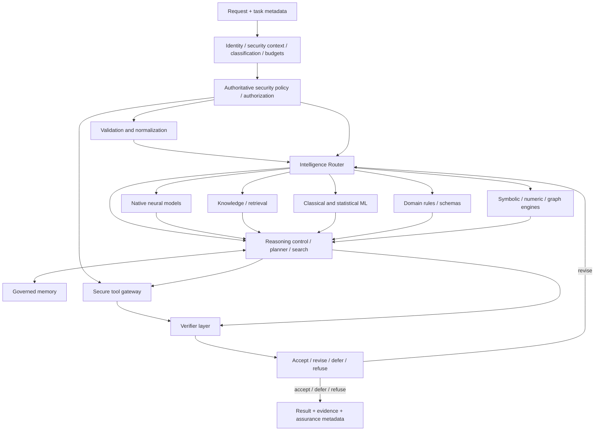

# Native Brain System Architecture

## Status

**Proposed — Roadmap P5: Native Brain Architecture**

This document defines a conceptual architecture and does not claim that the
corresponding runtime, models, routers, memory, retrieval, or verifier systems are
implemented. It is governed by
[ADR-0011](../decisions/ADR-0011-native-brain-system-architecture.md).

## Purpose

The Native Brain System is the control architecture that allows CyberSecGPT to
combine CyberSecGPT-controlled neural models with retrieval, deterministic rules,
classical/statistical ML, symbolic and graph engines, secure tools, memory, and
independent verification while preserving offline operation, explicit
authorization, provenance, and bounded resource use.

The design has three primary goals:

1. keep CyberSecGPT core intelligence independent of proprietary remote AI;
2. route each subproblem to the smallest competent authorized intelligence
   substrate rather than sending every task to the largest model; and
3. separate generation and interpretation from authorization, side effects, and
   final verification.

## Scope

P5 defines:

- cognitive subsystem boundaries;
- Intelligence Router inputs and outputs;
- reasoning-control abstractions;
- verifier and evidence boundaries;
- trust and authorization boundaries;
- repository ownership for executable follow-up work;
- local/offline and online/self-hosted architecture invariants; and
- conformance requirements for later implementations.

P5 does not select a tokenizer algorithm, neural architecture, training method,
model size, checkpoint encoding, inference backend, database, vector store,
policy technology, sandbox backend, or deployment platform. Those choices remain
owned by their roadmap milestones and accepted repository boundaries.

## Architectural invariants

A conforming design MUST preserve all of the following:

- proprietary remote AI providers are optional adapters, never core dependencies;
- core routing has an offline-capable path when the required native substrate is
  installed;
- model output, retrieved content, memory, and tool output are untrusted data;
- a model or router cannot create or widen authorization;
- the authoritative security-policy/authorization evaluator is outside router
  choice and cannot be selected, replaced, or bypassed by routing;
- effective data classification is derived or validated by authoritative policy
  and metadata and cannot be downgraded by user content, model output, routing,
  fallback, memory, retrieval, or tool output;
- privileged actions fail closed when authorization, scope, capability, policy,
  classification, or required evidence cannot be validated;
- routing decisions are structured, observable, versioned, bounded, explicitly
  bound to their request/security context, and time-limited;
- reasoning budgets have explicit ceilings and stop conditions;
- verification is separable from generation;
- evidence and provenance are distinguishable from model inference;
- repository dependencies remain acyclic; and
- no hidden remote-AI fallback is permitted for the native core.

## Logical architecture



The diagram is logical. It does not imply that every task uses every component or
that the components are separate processes.

The `Domain rules / schemas` substrate represents routable deterministic domain
logic such as parsers, validation rules, or task-specific rule engines. The
authoritative security-policy/authorization evaluator is a separate trusted
control-plane authority. The Intelligence Router consumes its constraints and
current decisions; the router MUST NOT select, replace, disable, or bypass the
authorizer.

## Repository ownership

| Native Brain responsibility | Conceptual or executable owner |
| --- | --- |
| Cross-repository architecture and conceptual contracts | `cybersecgpt-docs` |
| Stable cross-domain primitives and first-party model architecture contracts | `cybersecgpt-foundation` |
| Tokenizer artifacts and tokenizer compatibility | `cybersecgpt-tokenizer` |
| Model request execution, batching, streaming, checkpoint loading and serving | `cybersecgpt-inference` |
| Intelligence Router control, reasoning budgets, planning/search and runtime verifier orchestration | `cybersecgpt-reasoning` |
| Governed persistent memory | `cybersecgpt-memory` |
| Tool descriptors, typed calls, policy-gated side effects | `cybersecgpt-tools` |
| Device/resource/isolation primitives | `cybersecgpt-runtime` |
| Authorization, target scope, security policy and security evidence references | `cybersecgpt-security` |
| TEVV suites, regression, robustness measurements and promotion evidence | `cybersecgpt-evaluation` |
| Benchmarks | `cybersecgpt-benchmarks` |
| Product/API composition | existing approved application/platform repositories |

P5 does not create a `cybersecgpt-brain`, `cybersecgpt-model`,
`cybersecgpt-agents`, or `cybersecgpt-knowledge` repository.

## Request envelope

Before routing, a request is normalized into conceptual fields defined more
precisely by the
[native-brain conformance profile](../specifications/native-brain-conformance-profile.md).
At minimum the controller must be able to represent:

- request and correlation identity;
- task type and domain;
- task complexity;
- safety impact and source/claimed data-classification metadata;
- an authoritative effective data classification used for routing, storage,
  execution, logging, and output handling;
- identity/authorization references when privileged work is possible;
- the relevant security-policy revision or immutable policy-decision reference;
- latency, compute, memory, token, step, and deadline budgets;
- required accuracy, determinism, and explainability where applicable;
- offline and provider/network policy requirements;
- available capability snapshot; and
- verification requirements.

The free-form user request and any classification labels contained within it are
untrusted data inside this envelope. They do not override machine-evaluable
limits, authorization, policy, or the authoritative effective classification.
Unknown or conflicting classification must be resolved conservatively according
to security policy rather than implicitly downgraded.

## Intelligence Router

### Objective

The Intelligence Router selects the smallest competent and authorized substrate
or sequence of substrates for each subproblem.

It may route to:

- CyberSecGPT native general/reasoning/code/cyber models when implemented;
- embeddings, retrieval, reranking, or knowledge-graph services;
- deterministic schema and domain-rule engines;
- classical or statistical ML;
- symbolic, constraint, numerical, compiler, parser, or graph engines;
- governed memory;
- secure tools; and
- independent validators or verifier models.

The authoritative security-policy/authorization evaluator is not a routable
substrate. It supplies non-optional constraints and decisions that routing and
side-effect execution must obey.

### Inputs

Routing may consider:

```text
task_type
task_complexity
domain
safety_impact
authorization_state
security_policy_revision
effective_data_classification
uncertainty
latency_budget
compute_budget
memory_budget
token_or_step_budget
required_accuracy
required_determinism
required_explainability
offline_requirement
provider_network_policy
available_substrates
available_tools
available_knowledge
capability_snapshot_id
verification_requirements
deadline
```

### Output

A routing decision is structured data and includes, as applicable:

```text
routing_decision_id
request_id
router_policy_version
security_policy_revision
authorization_context_ref
effective_data_classification
offline_requirement
provider_network_policy
capability_snapshot_id
selected_substrates
selected_model_or_engine_versions
reasoning_budget
retrieval_policy
tool_policy
verification_policy
resource_allocations
fallback_policy
decision_reason_codes
decision_provenance
created_at
expires_at
```

`decision_reason_codes` provide concise auditable factors such as capability
match, deterministic requirement, offline requirement, security restriction, or
resource ceiling. Conformance does not require logging private chain-of-thought.

A routing decision is admitted only for the request and security state to which it
is bound. Executable implementations must reject the decision and re-evaluate
routing when it is expired or when its request, authorization/security context,
effective classification, provider/network policy, offline requirement,
capability snapshot, or relevant policy revision no longer matches current state.
Replanning creates a new linked routing decision; stale decisions are never
silently replayed.

### Routing rules

- Unknown capability is treated as unavailable, not assumed.
- A route cannot widen the request authorization context.
- The router cannot select, replace, disable, or bypass the authoritative
  security-policy/authorization evaluator.
- A route cannot lower effective data classification or weaken data-handling
  requirements established by authoritative policy or metadata.
- A route requiring a forbidden network dependency is rejected in offline mode.
- A provider adapter is never an implicit fallback for the native core.
- An expired or context-mismatched routing decision is rejected and replanned
  under current policy rather than replayed.
- Escalation to a more expensive substrate requires an allowed budget and a
  measurable reason such as capability mismatch, verification failure, or
  calibrated uncertainty.
- Deterministic policy and authorization are not delegated to a generative model.
- Router output is validated before execution.

## Reasoning control

Reasoning control is distinct from unrestricted text generation. It manages
bounded planning and revision using explicit policies.

Supported policy names may include:

```text
REFLEX
NORMAL
DEEP
ULTRA
RESEARCH
EXHAUSTIVE
```

These names describe resource/control profiles, not claims of intelligence.
Every policy has explicit ceilings for relevant dimensions such as candidates,
steps, model tokens, tool calls, wall-clock time, compute, memory, and verifier
passes.

A conceptual difficult-task lifecycle is:

```text
PLAN
→ GENERATE CANDIDATES
→ GATHER EVIDENCE / RUN AUTHORIZED ANALYSIS
→ CRITIQUE / SEARCH FOR COUNTEREXAMPLES
→ VERIFY
→ ACCEPT OR REVISE
```

The controller MUST stop when a hard deadline, authorization boundary, resource
ceiling, cancellation, safe-stop condition, or terminal verification decision is
reached.

## Verification boundary

Verification is a separate intelligence class. A verifier receives typed outputs,
evidence references, required assertions, model/tool/version metadata, and the
applicable verification policy. It returns a structured result such as:

- `supported`;
- `unsupported`;
- `contradictory`;
- `insufficient_evidence`;
- `policy_blocked`;
- `verification_error`.

Verification methods may include deterministic validation, tests, parsers,
compilers, static analysis, symbolic checks, evidence comparison, independent
models, security policy checks, or human review. A verifier model is not itself an
authorization authority.

Runtime reasoning may orchestrate verifier calls, while `cybersecgpt-evaluation`
owns broader TEVV suites and promotion/regression evidence. Domain owners retain
ownership of their deterministic validators.

## Tool and authorization boundary

The Native Brain System consumes the existing authorization and tool contracts.
Any proposed side effect follows:

```text
PROPOSED ACTION
→ NORMALIZE
→ AUTHENTICATE / LOAD GRANT
→ SCOPE CHECK
→ CURRENT AUTHORITATIVE POLICY DECISION
→ EFFECTIVE DATA-CLASSIFICATION CHECK
→ CAPABILITY CHECK
→ ROUTING-DECISION BINDING / EXPIRY CHECK
→ EFFECTIVE RESOURCE LIMITS
→ ISOLATED PREPARATION
→ EXECUTION
→ EVIDENCE
→ CLEANUP / ROLLBACK IF REQUIRED
→ VERIFICATION
```

Policy is checked at workflow admission and again immediately before each side
effect. An execution context is immutable except for consuming budgets or narrowing
scope. Routing metadata is not an authorization grant. Any authorization,
classification, policy, provider/offline, or routing-binding mismatch at the
side-effect boundary fails closed and requires a fresh admissible decision.

## Knowledge, retrieval, and memory boundary

Retrieved content and memory are context with provenance, not truth or authority.
The controller must preserve distinctions among:

- user claims;
- retrieved claims;
- observed telemetry;
- rule matches;
- ML predictions;
- model inferences;
- tool observations; and
- verifier conclusions.

P5 defines the capability boundary but does not select a knowledge-store
implementation or create a new repository. Later retrieval work must remain fully
capable of local/offline execution.

Retrieved content, memory, model output, and tool output may add evidence that
causes policy to raise handling requirements, but they cannot lower the effective
data classification established by authoritative policy and metadata.

## Native neural boundary

P5 does not select the first CyberSecGPT model architecture. When native models
exist, the router consumes immutable model capability descriptors and sends
validated model requests through `cybersecgpt-inference`.

A model:

- does not silently select a tokenizer;
- does not execute side-effecting tools directly;
- does not grant authorization;
- does not reinterpret resource limits;
- does not lower effective data classification;
- does not silently call a remote provider; and
- returns typed output with model/tokenizer identity and finish status.

## Failure and fallback

Fallback behavior is explicit and versioned.

A failure may trigger a different local substrate only when the fallback is
allowed by policy, capability, security, data-classification, deadline, and
resource constraints. A failure MUST NOT silently:

- enable Internet access;
- transmit data to a proprietary AI service;
- reduce required verification;
- lower effective data classification or weaken data-handling controls;
- widen scope;
- replay an expired or security-context-mismatched routing decision;
- disable evidence collection; or
- substitute an unverified model/artifact.

If no valid route remains, the system returns a typed unavailable, deferred,
uncertain, denied, or failed result with limitations.

## Deployment profiles

### Local / offline / air-gapped

Core operation uses only installed CyberSecGPT-controlled components and approved
local system tools. Network-deny operation is a required future verification
profile. Missing optional online information sources are reported explicitly.

### Online / self-hosted

The same logical brain runs on operator-controlled infrastructure. Online mode may
use larger CyberSecGPT models, distributed retrieval, or distributed inference,
but the core intelligence still comes from CyberSecGPT-controlled models and
systems.

An online deployment does not redefine an external provider as the core brain.

## Observability and assurance

The system should record enough structured metadata to reconstruct execution
without storing sensitive payloads or private reasoning traces:

- request/correlation identity;
- component and contract versions;
- routing decision, binding state, expiry, and reason codes;
- effective data classification and relevant security-policy revision where
  permitted by logging policy;
- reasoning-control policy and resource consumption;
- authorization/policy references when applicable;
- tool/evidence references;
- verifier policy and result;
- cancellation/failure/finish reason; and
- known limitations.

Logs remain subject to data classification, redaction, retention, and access
control.

## Security model

The detailed threats and controls are defined in the
[native-brain threat model](../security/native-brain-threat-model.md). The most
important trust boundaries are:

1. untrusted request/content to normalized controller state and authoritative
   effective classification;
2. capability metadata/artifacts to router decisions;
3. authoritative security policy to router constraints and side-effect admission;
4. router/model/reasoning output to authorization and tool execution;
5. tool observations to evidence and subsequent reasoning;
6. memory/retrieval content to current decision state;
7. model/checkpoint packages to execution; and
8. local core to optional network/provider adapters.

## P5 architecture acceptance criteria

P5 architecture documentation is reviewable when:

- ADR-0011 records the ownership and trust-boundary decision;
- this architecture defines the router, reasoning-control, verifier, tool,
  independence, and deployment boundaries;
- the threat model covers adversarial inputs, policy bypass, poisoning, artifact
  tampering, resource abuse, cross-tenant exposure, verifier failure, and provider
  fallback;
- the conformance profile defines structured conceptual contracts and invariants;
- existing model, agent, tool, event, authorization, and dependency contracts are
  not contradicted;
- architecture documentation validation passes; and
- architecture and security review occur before ADR-0011 becomes Accepted.

## Deferred implementation

The following remain later roadmap work and MUST NOT be represented as P5
implementation completion:

- P6 tokenizer implementation;
- P7 dataset pipeline;
- P8 trainable neural architecture;
- P9 training engine;
- P10 native pretrained weights;
- P12 advanced reasoning algorithms and learned routing;
- P13 native embedding/retrieval/reranking implementation;
- P14 persistent memory implementation;
- P15 secure agent runtime implementation;
- P16-P18 native local/distributed inference; and
- P20-P24 specialist models, software factory, and full TEVV.

P5 may create only the interfaces and architecture needed for those later systems
to interoperate safely.
