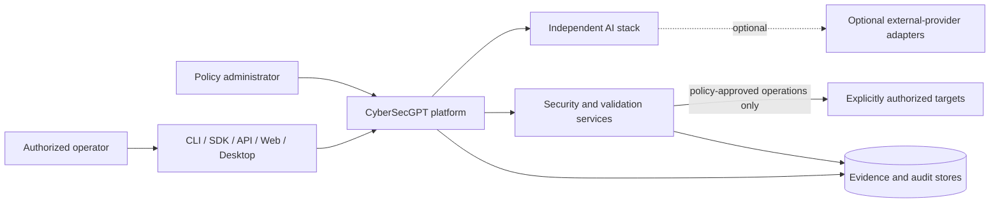
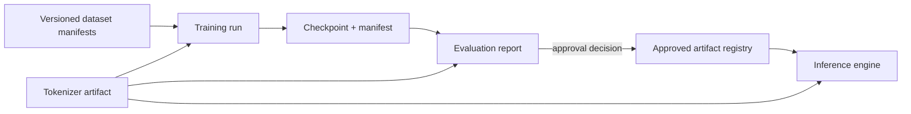
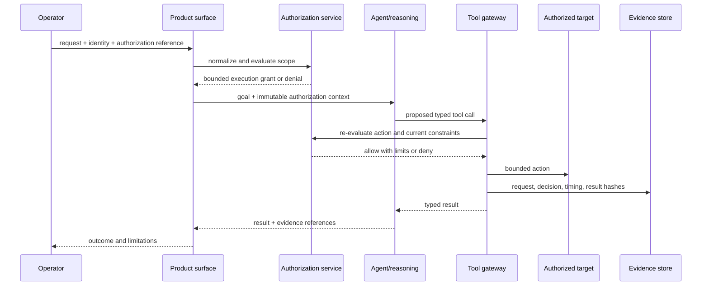

# System Overview

## Status

- **Established:** CyberSecGPT is designed for independent core operation.
- **Established:** external AI providers are optional adapters, never mandatory
  dependencies.
- **Established:** cybersecurity actions require explicit authorization, target
  scope, operator identity, policy enforcement, auditability, and bounded
  execution.
- **Proposed:** the layered component boundaries and flows in this document.
- **Observed:** as of 2026-07-25, most named repositories are empty placeholders;
  architecture should not be mistaken for implemented capability.

## Mission

CyberSecGPT combines an independently trainable and deployable AI stack with a
policy-controlled cybersecurity platform. Independence means the platform can
tokenize, train, load checkpoints, infer, reason, use approved tools, retain
governed memory, evaluate results, and operate without a hosted model provider.

The design separates:

1. durable contracts from implementations;
2. model computation from application orchestration;
3. reasoning from side-effecting tools;
4. security policy from security techniques;
5. evidence from mutable operational state; and
6. product services from deployment infrastructure.

## Context

The external-provider edge is optional and replaceable. A deployment that removes
all provider credentials and adapters must retain its core local-AI and
cybersecurity control-plane functions.

## Logical planes

### Contract and governance plane

Architecture documents, schemas, compatibility rules, policy definitions, and
governance decisions define what components may exchange. Runtime components
consume versioned contract artifacts; they must not import documentation tooling.

### Data and model plane

This plane owns dataset manifests, tokenizer artifacts, model architecture,
training, checkpoints, evaluation inputs, inference, and hardware-aware execution.
Training and inference share contracts and artifacts, not private implementation
modules.

### Intelligence plane

Reasoning, agent orchestration, memory, and tool discovery coordinate bounded work.
Reasoning proposes actions. It cannot grant authorization or bypass tool policy.
Memory is governed state, not an unbounded transcript dump.

### Security plane

The security plane evaluates policy, enforces authorization and target scope,
controls approved techniques, applies rate and timeout limits, and preserves
evidence. An authorized validation subsystem may be isolated further, but no
separate repository is considered implemented today.

### Product and enterprise plane

CLI, SDK, API, web, desktop, and platform services expose stable workflows.
Enterprise concerns include tenancy, identity federation, policy administration,
deployment controls, quotas, supportability, and licensing enforcement. Product
surfaces call public contracts; they do not reach into model or security internals.

### Operational plane

Infrastructure definitions, delivery automation, observability, backup, recovery,
and cloud deployment consume released artifacts. Production source code must not
depend on deployment repositories. Operational policy must not silently redefine
application authorization policy.

## Primary flows

### Model lifecycle

Every artifact is content-addressed or cryptographically hashed, records its
contract versions, and carries provenance sufficient for reproduction. Promotion
to an approved registry is a policy decision, not an automatic consequence of a
successful training job.

### Authorized operation lifecycle

Authorization is checked both at workflow admission and immediately before each
side effect. The agent cannot widen the immutable grant.

## Cross-cutting requirements

- **Identity:** every privileged operation resolves to an authenticated operator,
  service, and tenant where applicable.
- **Policy:** deny by default; decisions are explicit, explainable, and auditable.
- **Least privilege:** components receive only the resources and capabilities
  needed for the bounded task.
- **Reproducibility:** model and security results identify inputs, versions,
  configuration, seeds where meaningful, and execution environment.
- **Evidence integrity:** records are append-oriented, hashed, access-controlled,
  and retained under policy.
- **Resilience:** deadlines, cancellation, bounded retries, idempotency, and
  rollback guidance are part of public contracts.
- **Privacy:** data classification and minimization precede storage or model use.
- **Portability:** local and self-hosted execution remain first-class.
- **Observability:** structured events, metrics, and traces correlate without
  leaking secrets or sensitive payloads.

## Trust boundaries

The following inputs are untrusted until validated:

- user prompts and uploaded content;
- datasets and model artifacts;
- checkpoint manifests and tensor shards;
- tool arguments and tool output;
- target responses and network metadata;
- external-provider responses;
- plugins and adapters;
- memory retrieved from prior sessions; and
- policy bundles received from distribution systems.

Deserialization, template expansion, command execution, filesystem paths, network
destinations, and model loading are explicit validation boundaries.

## Related documents

- [Independent AI principles](independent-ai-principles.md)
- [Repository map](repository-map.md)
- [Dependency graph](dependency-graph.md)
- [Authorization model](../security/authorization-model.md)
- [Model contract](../specifications/model-contract.md)
- [Event contract](../specifications/event-contract.md)

## Unresolved decisions

- Final repository consolidations and names.
- Initial model families, parameter scales, and accelerator support.
- Concrete schema language and registry technology.
- Dataset licensing and model-output usage policy.
- Checkpoint container and tensor encoding.
- Multi-tenant deployment baseline and isolation technology.
- Organization-wide source-code and documentation license.
