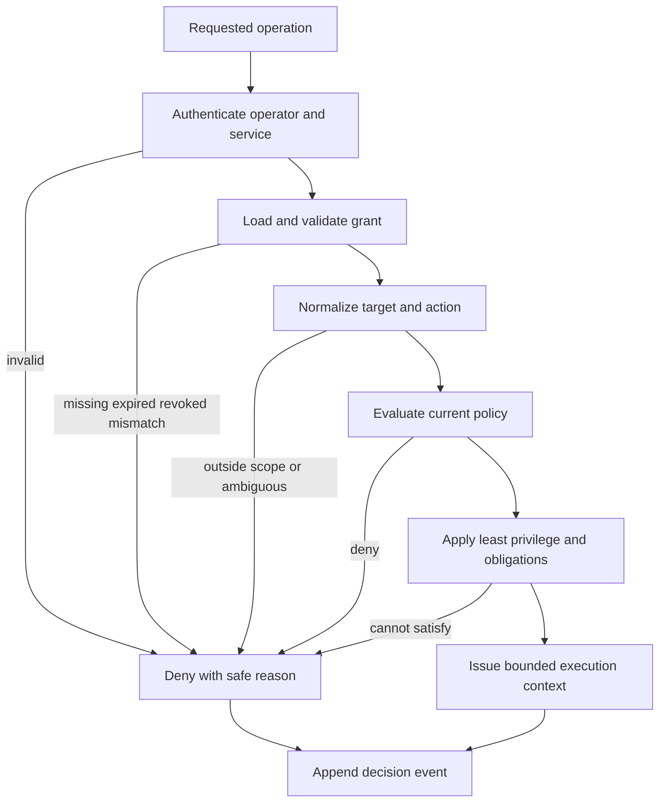

# Authorization Model

## Status

- **Established:** every cybersecurity or other privileged operation requires
  explicit target scope, authorization, operator identity, least privilege, policy
  enforcement, audit logging, rate limits, timeout controls, evidence preservation,
  reproducibility metadata, and rollback or cleanup guidance.
- **Established:** prompts, model output, memory, tool output, and external-provider
  responses cannot grant or widen authorization.
- **Proposed:** the conceptual records and evaluation sequence below.
- **Unresolved:** identity provider, policy engine, credential format, signing
  system, and retention periods.

## Actors

- **Operator:** authenticated human accountable for the requested activity.
- **Service identity:** authenticated workload acting on behalf of an operator or
  approved automation.
- **Target owner/authorizer:** authority able to approve operations on the target.
- **Policy administrator:** manages policy but does not implicitly gain target
  authorization.
- **Approver:** provides required independent approval for higher-risk activity.
- **Tool/agent:** constrained computational actor; never an authorizer.
- **Auditor:** reads protected decisions and evidence without execution privilege.

One person may hold multiple roles only when policy permits and separation-of-duty
requirements are met.

## Conceptual records

### Operator identity

`OperatorIdentity` contains:

- opaque operator identifier;
- authenticating authority and assurance level;
- organization and tenant;
- active roles and groups;
- authentication time;
- session identifier;
- service identity, when delegated; and
- delegation chain with expiry.

Authentication proves identity, not target authorization.

### Authorization grant

`AuthorizationGrant` contains:

- immutable grant identifier and version;
- authorizing party and evidence reference;
- grantee operator, team, service, or approved automation;
- exact `TargetScope` reference;
- allowed capability and method identifiers;
- prohibited capabilities;
- valid-from and expiry times;
- rate, concurrency, resource, and timeout ceilings;
- data-access and evidence-handling rules;
- required approvals and supervision;
- cleanup and rollback obligations;
- issuance, revocation, and signature metadata; and
- human-readable purpose.

Free-form text alone is insufficient. A machine-evaluable grant is required before
execution. The original authorization evidence remains preserved and access
controlled.

### Target scope

`TargetScope` contains canonical target selectors and exclusions, permitted
services/protocols, environments, time windows, methods, data boundaries, redirect
and dependency rules, and safe-stop conditions. See
[scope enforcement](scope-enforcement.md).

### Policy decision

`PolicyDecision` contains:

- unique decision identifier;
- decision: `allow`, `deny`, or `allow_with_obligations`;
- evaluated identity, grant, target, capability, and action hashes;
- policy bundle identifier and version;
- matched rule identifiers;
- obligations and limits;
- decision time and expiry;
- explanation safe for the caller; and
- integrity metadata.

An allow decision applies only to the exact normalized action evaluated.

Policy enforcement is mandatory at admission and at the final side-effect
boundary. An unavailable, stale, or unverifiable policy decision fails closed for
privileged operations.

### Execution context

`ExecutionAuthorizationContext` is immutable for one bounded execution and includes:

- identity, grant, scope, and policy-decision references;
- tenant and correlation identifiers;
- remaining time, rate, concurrency, resource, and action budgets;
- evidence destination and classification;
- cancellation and safe-stop state; and
- permitted tool capability set.

Agents and tools may consume budget or narrow context. They cannot add targets,
capabilities, duration, or privilege.

## Decision sequence

The tool gateway repeats scope and policy evaluation immediately before every side
effect. Long-running work periodically revalidates expiry, revocation, policy
revision, and remaining budgets.

## Least privilege

- Default deny all capabilities and targets.
- Grant specific capabilities, not arbitrary command execution.
- Use task-scoped, short-lived credentials.
- Separate read, analysis, validation, modification, and administration.
- Isolate tool processes, filesystems, networks, and secrets.
- Restrict evidence writers from altering authorization records.
- Restrict policy administrators from fabricating target-owner approval.
- Use per-tenant and per-target resource budgets.

## Rate, timeout, and cancellation

Every privileged operation has:

- admission rate limit;
- target-specific request rate;
- maximum concurrency;
- total action and resource budget;
- connection and operation timeouts;
- workflow deadline;
- retry ceiling;
- cancellation propagation; and
- post-cancellation cleanup deadline.

The most restrictive applicable limit wins. Limit exhaustion does not authorize a
new identity, target, method, or session.

## Audit and evidence

Record authentication result, grant reference, normalized scope, action, policy
decision, obligations, tool/technique version, timestamps, limits, outcome,
evidence digest, cleanup, and error code. Use opaque references for sensitive
targets and identities where possible.

Evidence is append-oriented, hashed, encrypted, access-controlled, and classified.
Authorization records and evidence are linked but stored so an evidence writer
cannot rewrite the grant.

## Reproducibility

A validation result identifies:

- source and tool versions;
- policy and grant revisions;
- normalized scope hash;
- safe configuration hash;
- timing and environment;
- input/evidence digests;
- rate and timeout settings;
- randomness seed where meaningful; and
- known sources of non-determinism.

Reproduction requires a new currently valid authorization. Prior authorization is
evidence, not reusable permission.

## Revocation and failure

Revocation propagates to admission and active workflows. Components stop at the
next safe boundary, prevent new side effects, preserve evidence, and execute only
the cleanup actions already authorized or required by safety policy.

If identity, grant, policy, audit, scope, time, or limit state cannot be verified,
the operation fails closed. Read-only product functions may degrade according to a
separate policy; privileged security operations may not.

## Rollback and cleanup

Each capability declares whether it is:

- observation-only;
- idempotent;
- reversible with a defined rollback; or
- irreversible and therefore prohibited unless separately approved.

The execution plan records preconditions, expected side effects, cleanup, rollback
verification, and operator escalation. Rollback must remain within scope and must
not erase audit evidence.

## Testing requirements

Contract tests cover missing, expired, revoked, forged, delegated, cross-tenant,
out-of-scope, over-limit, timed-out, and policy-changed cases. Tests prove prompts,
memory, redirects, and tool output cannot widen authorization.

## Related contracts

- [Scope enforcement](scope-enforcement.md)
- [Tool contract](../specifications/tool-contract.md)
- [Agent contract](../specifications/agent-contract.md)
- [Event contract](../specifications/event-contract.md)
- [Logging standard](../standards/logging-standard.md)

## Unresolved decisions

- Identity and policy technologies.
- Authorization-grant signing and revocation transport.
- Minimum assurance and approval levels by capability.
- Evidence and decision retention.
- Break-glass process and oversight.
- Canonical capability and policy registries.
