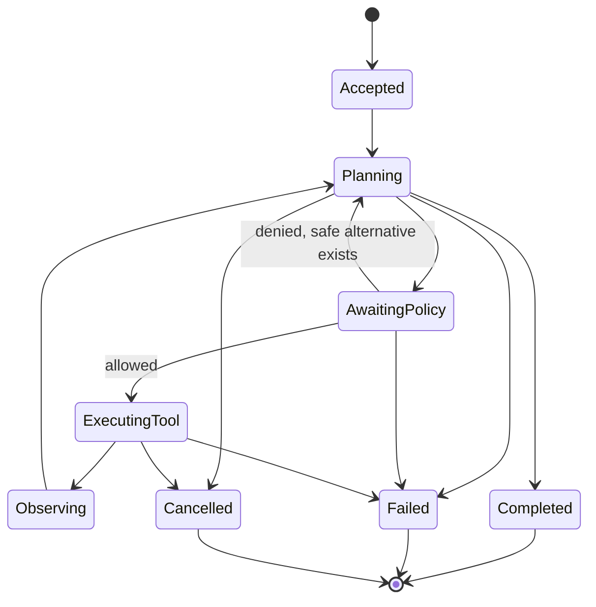

# Agent Contract

## Status

This is a **stable conceptual contract proposal** for bounded agent execution.
`cybersecgpt-reasoning` exists but is empty; `cybersecgpt-agents` does not exist.
No production agent framework is claimed.

The authoritative implementation owner is `cybersecgpt-reasoning` under
[ADR-0006](../decisions/ADR-0006-agent-runtime-ownership.md). The absent proposed
`cybersecgpt-agents` repository is deferred.

## Principles

- Agents pursue explicit goals within immutable budgets and authorization.
- Models propose; deterministic policy authorizes.
- Tools own side effects behind a policy-enforced gateway.
- Memory is accessed through governed contracts.
- Every state transition is observable and terminal behavior is explicit.
- External AI providers are optional model adapters.
- Agents cannot self-authorize, widen scope, mint credentials, or suppress audit.

## Core types

### `AgentDescriptor`

- stable agent type and revision;
- contract version;
- declared capabilities;
- compatible model capabilities;
- permitted tool capability classes;
- memory requirements;
- default budget ceilings;
- supported execution modes;
- policy profile reference; and
- implementation/provenance metadata.

### `AgentRequest`

- unique request and correlation identifiers;
- goal and typed inputs;
- operator/tenant references;
- immutable `ExecutionAuthorizationContext` reference;
- model selection constraints, never only a mutable `latest` label;
- permitted tool and memory capability set;
- step, token, time, cost, concurrency, and resource budgets;
- output contract;
- cancellation/deadline;
- evidence and data-classification policy; and
- idempotency key where the workflow may be retried.

The goal is not authorization. Conflicting goal and authorization results in
denial or a narrowed plan.

### `AgentState`

Conceptual states:

Every transition has a monotonic sequence, cause, event, budget snapshot, and
timestamp. Terminal states occur exactly once.

### `Plan` and `AgentStep`

A plan contains ordered or dependency-linked steps. A step declares:

- step identifier and expected input/output types;
- proposed capability or tool;
- target/scope reference if applicable;
- preconditions and policy requirements;
- expected side effects;
- time and resource estimate;
- evidence expectation;
- safe stop, cleanup, and rollback; and
- dependencies on prior observations.

Plans are advisory until each side effect is re-authorized.

### `AgentResult`

- terminal status and finish reason;
- typed output or safe error;
- model, agent, tool, memory, policy, and contract revisions;
- budget consumption;
- evidence and event references;
- side effects and cleanup status;
- limitations and unresolved observations; and
- reproducibility metadata.

## Execution semantics

1. Validate request, identity, authorization, output schema, and budgets.
2. Resolve model/tool/memory capabilities through registries.
3. Create bounded initial state and emit acceptance.
4. Produce or revise a plan.
5. Validate a proposed tool call against current grant, scope, policy, and budget.
6. Execute through the tool gateway with deadline and cancellation.
7. Treat returned content as untrusted observation.
8. Update state, evidence references, and budgets.
9. Complete, fail, cancel, or continue within limits.
10. Emit exactly one terminal event and verify cleanup.

The runtime refuses an unbounded request. Budget extension is a new authorized
decision by an accountable actor.

## Delegation

Delegation creates a child agent request with:

- parent and causation identifiers;
- a strict subset of the parent's authorization, capabilities, data, and budget;
- explicit expected output;
- separate cancellation and evidence;
- maximum depth and fan-out; and
- no ability to delegate further unless explicitly allowed.

Child failure and partial side effects are visible to the parent. Delegation never
transfers credentials as prompt text.

## Model boundary

Model output is parsed as untrusted data against a typed schema. Invalid output
does not execute. Model selection, retries, and fallback remain within request
capabilities, budget, data policy, and provider restrictions.

Hidden chain-of-thought is not required in results or logs. Systems may preserve
concise decision rationale, plan facts, and policy explanations without exposing
private reasoning tokens.

## Tool boundary

Tool calls conform to the [tool contract](tool-contract.md). The gateway validates
descriptor/version, input schema, authorization, target scope, identity, rate,
deadline, resources, idempotency, and evidence before execution.

An agent cannot call a tool by constructing an undocumented command or direct
network request.

## Memory boundary

Memory reads and writes are typed, tenant-scoped, purpose-bound, classified, and
retention-aware. Retrieved memory is untrusted context. Agent completion does not
imply all conversation content should become long-term memory.

## Events

Agent events conform to the [event contract](event-contract.md). Event types
conceptually include accepted, plan-created, step-proposed, policy-decided,
tool-started, observation-received, budget-updated, cancelled, failed, and
completed.

## Failure and recovery

Failures identify whether side effects began, evidence exists, cleanup completed,
and retry is safe. Retrying requires valid authorization, remaining deadline, and
idempotency. Policy, scope, integrity, and deterministic validation failures are
not automatically retried.

Cancellation prevents new side effects, propagates to active tools, preserves
evidence, runs authorized cleanup, and emits a terminal event.

## Conformance tests

- request and descriptor validation;
- exact budget exhaustion behavior;
- deterministic fake model and tool flows;
- invalid and injected model/tool/memory content;
- authorization denial and inability to widen scope;
- delegation subset, depth, and fan-out;
- event ordering, causation, deduplication, and terminal uniqueness;
- cancellation, timeout, retry, idempotency, partial side effects, and cleanup;
- optional-provider removal; and
- output/evidence redaction.

## Unresolved decisions

- Concrete state/event schemas and persistence.
- Planner and policy integration interfaces.
- Default budgets and delegation limits.
- Memory retention and learning behavior.
- Human approval and supervision UX.
