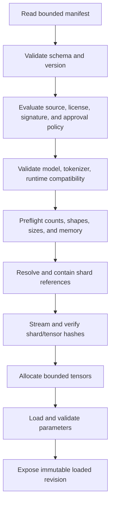

# Checkpoint Format

## Status

This document defines a **proposed logical checkpoint contract**, not a finished
binary format. `cybersecgpt-training` and `cybersecgpt-inference` are empty
repositories; no loader or writer is production-ready.

The manifest semantics are intended to remain stable while concrete tensor
containers, compression, canonical encoding, and signing are **Unresolved**.
`cybersecgpt-foundation` owns the logical manifest schema,
`cybersecgpt-training` owns checkpoint production, and
`cybersecgpt-inference` owns loading under
[ADR-0005](../decisions/ADR-0005-model-ownership.md) and
[ADR-0010](../decisions/ADR-0010-artifact-and-event-contracts.md).

## Goals

- Portable first-party model artifacts.
- Safe validation before tensor allocation.
- Explicit model/tokenizer/runtime compatibility.
- Sharded, resumable, content-addressed storage.
- Training provenance, evaluation, and promotion references.
- Integrity, authenticity when required, atomic publication, and rollback.
- No mandatory executable deserialization.

## Package model

A checkpoint is an immutable logical package:

```text
checkpoint/
├── manifest.<encoding>
├── tensors/
│   ├── shard-00000.<encoding>
│   └── shard-00001.<encoding>
├── optional-adapters/
├── reports/
└── signatures/
```

Names are illustrative. Loaders use manifest entries, not directory discovery.
Paths are relative, normalized, unique, and contained within the package root.

## Manifest

Required conceptual sections:

### Identity

- checkpoint format version;
- checkpoint artifact identifier;
- manifest digest and canonicalization identifier;
- model ID, revision, architecture ID, and parameter schema;
- tokenizer fingerprint;
- checkpoint kind: full, delta, adapter, optimizer, or training-state;
- creation time and producing component/version.

### Tensor index

For every tensor:

- canonical parameter name;
- semantic role, when defined;
- shape using bounded non-negative dimensions;
- dtype and numeric encoding;
- shard reference;
- byte offset and length;
- tensor digest;
- layout/endian information; and
- optional quantization metadata with versioned schema.

Names are unique. Byte regions do not overlap unless the format explicitly and
safely defines aliasing.

### Shards

For every shard:

- relative path or approved content-addressed object reference;
- encoded and decoded size;
- digest and digest algorithm;
- container/encoding identifier;
- compression identifier and bounded expansion information; and
- optional encryption metadata referring to external key management.

Secrets and decryption keys are never embedded in the manifest.

### Compatibility

- supported model-contract range;
- architecture and parameter-schema versions;
- tokenizer fingerprint;
- minimum loader capabilities;
- runtime/device constraints;
- required numeric kernels;
- base checkpoint identity for deltas/adapters; and
- declared migration history.

### Provenance

- training run identifier and source revision;
- dataset manifest digests;
- tokenizer artifact identity;
- safe configuration digest;
- dependency/build environment reference;
- parent checkpoint(s);
- random seeds and known non-determinism;
- training metrics reference;
- evaluation report and approval references;
- license metadata for code, data, model, and weights; and
- producer attestation.

### Integrity and signatures

- canonical manifest digest;
- artifact/shard digests;
- signature objects, signer identity, trust policy, and timestamp references when
  required;
- revocation/status references; and
- transparency/provenance record, when configured.

A digest provides integrity, not authorization or trust by itself.

## Writer requirements

1. Validate model and parameter schema.
2. Write shards to invocation-owned temporary or content-addressed locations.
3. Flush and hash complete shards.
4. Construct and validate the manifest.
5. Produce required signatures/attestations.
6. Publish atomically or with an immutable commit marker.
7. Record provenance and terminal event.
8. Leave the prior approved checkpoint unchanged for rollback.

Interrupted writes are not discoverable as complete checkpoints. Cleanup never
deletes pre-existing artifacts.

## Loader sequence



Failure before `Ready` exposes no partially loaded model as available. Resource
preflight occurs before large allocation or decompression.

## Safety requirements

- No pickle, arbitrary object graph, embedded script, dynamic import, or artifact
  supplied executable code is required by the interchange format.
- Reject absolute paths, traversal, symlink escape, duplicate normalized paths,
  device files, and unexpected members.
- Bound manifest size, tensor count, rank, dimensions, total parameters, bytes,
  shards, decompression ratio, and metadata depth.
- Use overflow-safe arithmetic.
- Verify every referenced byte range and digest.
- Do not fetch undeclared remote content.
- Network retrieval uses allowlists, authentication, TLS verification, range and
  size limits, deadlines, and evidence.
- Decryption and signature verification use approved libraries and external key
  management.
- Artifact metadata and errors do not expose secrets.

## Training state

Optimizer, scheduler, scaler, and random state are distinct optional sections or
artifacts. An inference checkpoint does not require them. Training resumption
validates code/config compatibility and must not deserialize executable state.

## Delta and adapter checkpoints

A delta or adapter names an exact immutable base checkpoint and its application
order. Loaders verify base identity, parameter targets, shapes, numeric semantics,
and resulting identity. Missing or different bases fail; mutable labels are not
accepted.

## Promotion and rollback

A checkpoint has states such as candidate, evaluated, approved, deprecated,
revoked, or rejected in an external registry. The checkpoint cannot self-declare
approval.

Promotion records evaluation and policy evidence. Rollback selects a prior
approved immutable identity and validates current runtime compatibility. Revocation
prevents new loads and triggers policy-defined handling of active sessions.

## Compatibility and migration

Unsupported major format versions fail safely. A migration:

- reads through a validated supported loader;
- writes a new immutable artifact;
- records source and destination identities;
- verifies semantic equivalence with conformance vectors;
- never mutates the source; and
- preserves rollback.

## Conformance tests

- valid minimal and sharded fixtures;
- unknown optional and required fields;
- unsupported versions and algorithms;
- digest/signature failure;
- duplicate names and overlapping ranges;
- invalid shapes, dtypes, offsets, integer overflow, and resource limits;
- path traversal, absolute paths, symlinks, and decompression limits;
- tokenizer/model/runtime mismatch;
- interrupted publication and cleanup;
- delta base mismatch;
- migration and rollback; and
- rejection of executable serialization.

## Unresolved decisions

- Canonical manifest encoding and digest algorithm.
- Tensor container(s), compression, and quantization schemas.
- Encryption envelope and key-management profile.
- Signing, timestamping, trust roots, and revocation.
- Registry API and promotion states.
- Maximum supported artifact and tensor limits.
- Model and weight licensing.
