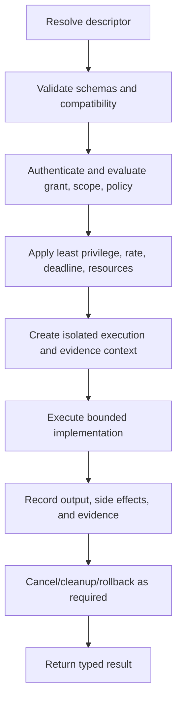

# Tool Contract

## Status

This is a **stable conceptual contract proposal** for tool discovery and bounded
execution. `cybersecgpt-tools` exists but is empty; no sandbox, registry, or tool
implementation is claimed production-ready.

## Principles

- Every tool has a typed descriptor and version.
- Side effects are explicit and policy-controlled.
- Inputs and outputs are untrusted until validated.
- Authorization, operator identity, target scope, rate, timeout, evidence, and
  cleanup are checked before execution.
- Tool capabilities are narrower than arbitrary process, filesystem, or network
  access.
- External provider tools are optional adapters.

## `ToolDescriptor`

| Field | Meaning |
| --- | --- |
| `tool_id` | stable namespaced identifier |
| `tool_version` | implementation version |
| `contract_version` | tool contract version |
| `summary` | concise non-authoritative description |
| `capability_id` | policy-recognized capability |
| `risk_class` | governance-defined risk classification |
| `input_schema` | versioned bounded input contract |
| `output_schema` | versioned bounded output contract |
| `side_effect_class` | none, read, write, external interaction, administration |
| `idempotency` | semantics and key requirements |
| `required_permissions` | least-privilege service capabilities |
| `target_dimensions` | scope dimensions evaluated |
| `default_limits` | maximum time, output, resource, concurrency, and rate |
| `evidence_profile` | required evidence and classification |
| `cleanup_profile` | safe-stop, cleanup, and rollback semantics |
| `runtime_requirements` | sandbox and platform capabilities |
| `provenance` | source, build, package, and signer information |

Descriptions, examples, and model claims never override machine-readable
capability and policy fields.

## `ToolCall`

- unique call, correlation, and causation identifiers;
- exact tool ID/version or compatible immutable resolution;
- validated arguments;
- operator, service, tenant, authorization, policy, and scope references;
- target reference;
- idempotency key where applicable;
- requested limits no greater than descriptor/grant/policy limits;
- deadline and cancellation;
- evidence destination/classification; and
- agent/request provenance.

A tool call is immutable once admitted. Changes create a new call and policy
decision.

## `ToolResult`

- call and tool identity;
- status: success, denied, partial, cancelled, timeout, or error;
- typed output;
- stable finish and error codes;
- start/end and resource usage;
- declared side effects and whether they occurred;
- evidence digests/references;
- cleanup and rollback status;
- retryability and idempotency outcome;
- warnings/limitations; and
- reproducibility metadata.

Large or sensitive results reside in a protected artifact/evidence store; the
result carries a reference and digest.

## Execution lifecycle

Policy is re-evaluated immediately before a side effect. If required audit or
evidence storage is unavailable, high-risk tools fail closed.

## Tool implementation interface

Conceptual operations:

1. `describe()` returns immutable descriptor.
2. `validate(call)` performs side-effect-free schema and semantic validation.
3. `estimate(call)` returns bounded resource and side-effect estimates.
4. `prepare(context)` acquires least-privilege isolated resources.
5. `execute(context, call)` produces progress and one terminal result.
6. `cancel(call_id)` requests safe termination.
7. `cleanup(context)` releases invocation-owned resources idempotently.
8. `rollback(context, evidence)` performs only declared, authorized compensation.

Language-specific APIs may differ.

## Isolation

Policy can require:

- dedicated process/container/VM;
- read-only base filesystem and invocation-owned writable area;
- network destination allowlist;
- system-call/capability restrictions;
- unprivileged identity;
- scoped ephemeral credentials;
- CPU, memory, storage, output, and process limits;
- disabled dynamic plugin loading; and
- verified cleanup.

A tool that cannot satisfy required isolation is unavailable, not silently
downgraded.

## Rate and timeout behavior

The effective limit is the minimum of descriptor, grant, policy, tenant, target,
environment, and caller. Tools expose progress without extending deadline.
Retries consume the same workflow budget and require idempotency.

On cancellation or timeout, stop new side effects, preserve evidence, execute
authorized cleanup, and return explicit partial state.

## Security validation tools

Tools interacting with cybersecurity targets additionally require:

- explicit target-owner authorization;
- canonical scope evaluation at connection/action time;
- capability-specific policy approval;
- operator identity and, when required, supervision;
- non-destructive defaults;
- bounded target rate and concurrency;
- evidence capture and reproducibility;
- safe-stop and cleanup; and
- no persistence, evasion, credential theft, malware, destructive behavior, or
  unauthorized access.

Discovering an out-of-scope asset may produce a redacted observation but never
authorizes interaction.

## Registration and trust

The registry verifies descriptor schema, unique identity/version, package digest,
provenance/signature policy, compatibility, risk classification, conformance
evidence, and revocation state. Registration does not automatically make a tool
available to every tenant, agent, or operator.

Dynamic tool descriptions from untrusted sources are not auto-registered.

## Events and logging

Emit proposed, admitted/denied, started, progress, side-effect, evidence, cleanup,
and terminal events using the [event contract](event-contract.md). Logs follow the
[logging standard](../standards/logging-standard.md) and exclude sensitive
payloads.

## Conformance tests

- descriptor/schema and unknown-version handling;
- malformed and oversized input/output;
- absent, expired, revoked, cross-tenant, and out-of-scope grants;
- least privilege and isolation;
- rate, concurrency, deadline, cancellation, and resource limits;
- idempotent replay and conflicting keys;
- partial side effects, evidence, cleanup, rollback, and cleanup failure;
- injected tool output;
- unavailable audit/evidence sinks; and
- stable typed errors and redaction.

## Unresolved decisions

- Registry, package, and signing technology.
- Capability and risk taxonomies.
- Sandbox backends and supported platforms.
- Progress and streaming schema.
- Evidence store and retention.
- Human approval protocol.
